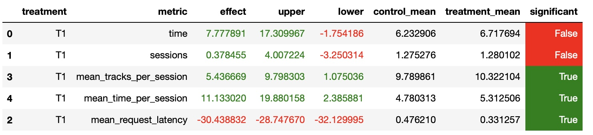

# made_recsys
botify service developed at MADE RecSys course

# Результаты
Удалось улучшить ключевую метрику




# Основная идея
Если прошлый трек пользователь прослушал больше 0.8, то добавляем к множеству любимых треков этого пользователя и идем за рекомендацииями из семинара
Если прошлый трек пользователь прослушал меньше 0.2, то берем рекомендации из семинара для какого-то любимого трека пользователя. Если любимых пока нет, то берем какой-то топовый трек.

Весь пайплайн описан в my_recommender.py

# Как запустить

Запускаем botify server для этого 
1. Переход в директорию botify
   ```
   cd botify
   ```

1. Собираем образы и запускаем контейнеры
   ```
   docker-compose up -d --build 
   ```   
   
Создаем окружение для sim и запускаем симуляцию 
1. Переход в директорию sim
   ```
   cd ..
   cd sim
   ```
2. Создаем чистый env с python 3.7
3. Устанавливаем зависимости
   ```
   pip install -r requirements.txt
   ``` 
3. Добавляем текущую директорию в $PYTHONPATH
   ```
   export PYTHONPATH=${PYTHONPATH}:.
   ```
4. Запуск симулятора в режиме "трафика" в многопоточном режиме.
   Многопоточный режим ускоряет сбор данных.
   ```
   python sim/run.py --episodes 1000 --config config/env.yml multi --processes 3
   
Копируем логи из контейнера на локальную машину и запускаем ноутбук с A/B тестом
1. Скачиваем логи пользовательских сессии с контейнера
   ```
   docker cp recommender-container:/app/log/ /log/
   ```

2. Или используем готовые из /log/data6/data.json

Открываем ноутбук Week1Seminar.ipynb и запускаем все ячейки

